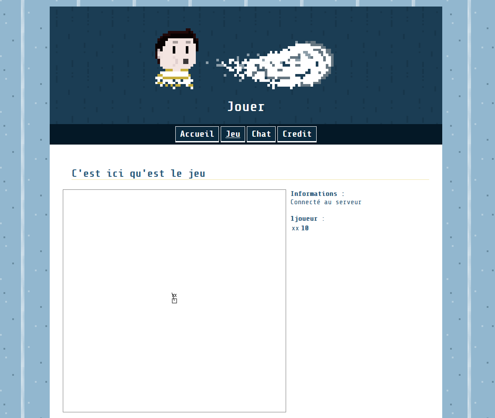
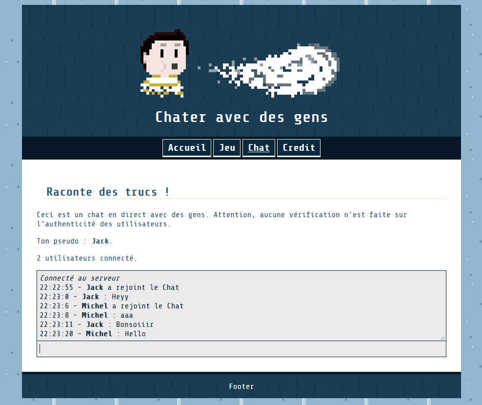

# NodeJsProjet

Projet de découverte de NodeJs. Heberge un site proposant un jeu multijoueur ainsi qu'un chat.

Permet de fournir du contenu statique et du contenu dynamique. La liste des différents urls accéssibles est configurée par le fichier ```elements.json``` a la racine du dépot.

## Utilisation

Lancer ```start.bat```, une fois le serveur en marche le site est accéssible en local a l'adresse suivante ```localhost:8080```.  Fonctionne au moins sous firfox.

## Exemple de fonctionnement
```
>start.bat
>node serveur.js
---- 6/23/2018 22:19:24 ----
LOG. Chargement des éléments
LOG. Serveur HTTP en écoute
LOG. Chargement de socketProcess
     Succes - /index
     Succes - /error404
     Succes - /game
     Succes - /chat
     Redéfinition d'url : /credit -> /cred
     Succes - /credit
     Succes - /clientScript/chatClient.js
     Succes - /clientScript/pingClient.js
     Succes - /clientScript/canvas.js
     Succes - /clientScript/gameObjects.js
     Succes - /clientScript/gameClient.js
     Succes - /img/map.png
     Succes - /img/patternBody.png
     Succes - /img/mindmap.png
     Succes - /style/style.css
     Succes - /clientScript/util.js
     Succes - /img/patternHeader.png
     Succes - /img/header.png
---- 6/23/2018 22:19:42 ----
```

_Capture d'écran de la page de jeu_


_Capture d'écran de la page de chat_

